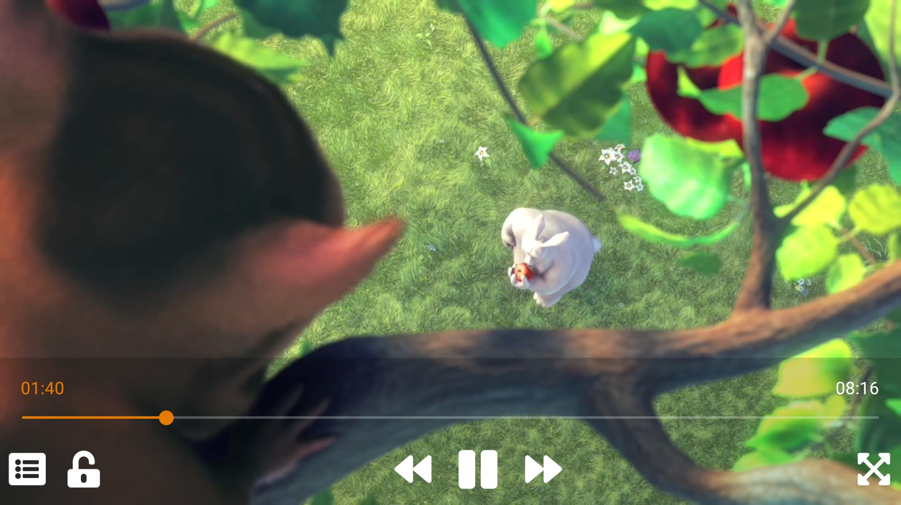

<h3 align="center">
    
</h3>

# LibVLCSharp

[](https://videolan.visualstudio.com/LibVLCSharp/_build?definitionId=22)
[](https://discord.gg/3h3K3JF)
[](https://code.videolan.org/videolan/LibVLCSharp/-/blob/3.x/docs/home.md)

LibVLCSharp is a cross-platform audio and video API for .NET platforms based on VideoLAN's LibVLC Library.
It provides a comprehensive multimedia API that can be used across mobile, server and desktop to render video and output audio as well as encode and stream.

_The official repository URL for this repo is https://code.videolan.org/videolan/LibVLCSharp._

- [Features](#features)
  - [MediaPlayerElement](#mediaplayerelement)
- [Supported platforms](#supported-platforms)
- [Installation](#installation)
  - [Preview builds](#Pre-release-versions)
- [Getting started](#getting-started)
- [Documentation](#documentation)
- [Ebook](#ebook)
- [Migrating from Vlc.DotNet](docs/migrating_from_Vlc.DotNet.md)
- [Samples](#samples)
- [Quick API overview](#quick-api-overview)
- [Roadmap](#roadmap)
- [Versioning](#versioning)
- [Release Notes](#release-notes)
- [Contribute](#contribute)
  - [Pull request](#pull-request)
  - [Gitlab issues](#gitlab-issues)
- [Questions and Support](#questions-and-support)
  - [Bug trackers](#bug-trackers)
  - [Discord](#discord)
  - [StackOverflow](#stackoverflow)
  - [Commercial Support](#commercial-support)
- [Code of Conduct](#code-of-conduct)
- [Licenses](#licenses)

## Features

Check out [libvlc-nuget](https://code.videolan.org/videolan/libvlc-nuget) to get a basic understanding of how `libvlc` works, what it can offer and how to install it with NuGet.

Some of the [features](https://www.videolan.org/vlc/features.html) include:

- Play every media file formats, every codec and every streaming protocols
- Run on every platform, from desktop (Windows, Linux, Mac) to mobile (Android, iOS) and TVs
- Hardware and efficient decoding on every platform, up to 8K
- Network browsing for distant filesystems (SMB, FTP, SFTP, NFS...) and servers (UPnP, DLNA)
- Playback of Audio CD, DVD and Bluray with menu navigation
- Support for HDR, including tonemapping for SDR streams
- Audio passthrough with SPDIF and HDMI, including for Audio HD codecs, like DD+, TrueHD or DTS-HD
- Support for video and audio filters
- Support for 360 video and 3D audio playback, including Ambisonics
- Able to cast and stream to distant renderers, like Chromecast and UPnP renderers.

Most things you can achieve with the regular VLC desktop app, you can also achieve using `libvlc`.

### MediaPlayerElement

Full featured video control for Xamarin.Forms available in LibVLCSharp.Forms (iOS/Android) and Uno platform (iOS/Android/UWP).

<h3 align="center">
  
</h3>

## Supported platforms

Mono, .NET Framework and .NET Core runtimes are supported.

- Xamarin.Android
- Xamarin.iOS
- Xamarin.tvOS
- Xamarin.Mac (Cocoa)
- Windows Classic (WPF, WinForms, GTK)
- Windows Universal (UWP for Desktop, mobile and Xbox)
- Linux including desktop, server and Raspberry Pi (GTK)
- Xamarin.Forms
- Uno Platform (UWP, Android, iOS)
- Avalonia (Windows, macOS, Linux)
- .NET Standard 1.1 and 2.0
- .NET Framework 4.0 and later
- .NET Core (including ASP.NET Core)
- [Unity3D](https://code.videolan.org/videolan/vlc-unity)
  - Windows Classic
  - Android

## Installation

1. Install **LibVLC** in your platform specific project.

LibVLC is the actual VLC engine written mostly in C/C++ and compiled for your target platform. More information [here](https://code.videolan.org/videolan/libvlc-nuget).

| Platform          | LibVLC Package                      | NuGet                                  | Minimum OS Version |
| ----------------- | ----------------------------------- | -------------------------------------- |--------------------|
| Windows           | VideoLAN.LibVLC.Windows             | [![LibVLCWindowsBadge]][LibVLCWindows] | Windows XP         |
| UWP               | VideoLAN.LibVLC.UWP                 | [![LibVLCWin10Badge]][LibVLCWin10]     | Windows 10         |
| Mac               | VideoLAN.LibVLC.Mac                 | [![LibVLCMacBadge]][LibVLCMac]         | macOS 10.7         |
| Android           | VideoLAN.LibVLC.Android             | [![LibVLCAndroidBadge]][LibVLCAndroid] | Android 2.3        |
| iOS               | VideoLAN.LibVLC.iOS                 | [![LibVLCiOSBadge]][LibVLCiOS]         | iOS 8.4            |
| tvOS              | VideoLAN.LibVLC.tvOS                | [![LibVLCtvOSBadge]][LibVLCtvOS]       | tvOS 10.2          |
| Linux             | [Linux guide](docs/linux-setup.md)  | N/A                                    | N/A                |

```cmd
dotnet add package VideoLAN.LibVLC.[Windows|UWP|Android|iOS|Mac|tvOS]
```

2. Install **LibVLCSharp** _or_ **LibVLCSharp.Forms** (if you plan on using Xamarin.Forms)

LibVLCSharp is the .NET wrapper that consumes `LibVLC` and allows you to interact with native code from C#/F#.

| Platform          | LibVLCSharp Package                             | NuGet                                             |
| ----------------- | ----------------------------------------------- | ------------------------------------------------- |
| .NET Standard     | [LibVLCSharp](src/LibVLCSharp/README.md)        | [![LibVLCSharpBadge]][LibVLCSharp]                |
| Xamarin.Android   | [LibVLCSharp](src/LibVLCSharp/README.md)        | [![LibVLCSharpBadge]][LibVLCSharp]                |
| Xamarin.iOS       | [LibVLCSharp](src/LibVLCSharp/README.md)        | [![LibVLCSharpBadge]][LibVLCSharp]                |
| Xamarin.tvOS      | [LibVLCSharp](src/LibVLCSharp/README.md)        | [![LibVLCSharpBadge]][LibVLCSharp]                |
| Xamarin.Mac       | [LibVLCSharp](src/LibVLCSharp/README.md)        | [![LibVLCSharpBadge]][LibVLCSharp]                |
| UWP               | [LibVLCSharp](src/LibVLCSharp/README.md)        | [![LibVLCSharpBadge]][LibVLCSharp]                |
| Xamarin.Forms     | [LibVLCSharp.Forms][RLibVLCSharpForms]          | [![LibVLCSharpFormsBadge]][LibVLCSharpForms]      |
| WPF               | [LibVLCSharp.WPF][RLibVLCSharpWPF]              | [![LibVLCSharpWPFBadge]][LibVLCSharpWPF]          |
| Xamarin.Forms.WPF | [LibVLCSharp.Forms.WPF][RLibVLCSharpFormsWPF]   | [![LibVLCSharpFormsWPFBadge]][LibVLCSharpFormsWPF]|
| GTK               | [LibVLCSharp.GTK][RLibVLCSharpGTK]              | [![LibVLCSharpGTKBadge]][LibVLCSharpGTK]          |
| Xamarin.Forms.GTK | [LibVLCSharp.Forms.GTK][RLibVLCSharpFormsGTK]   | [![LibVLCSharpFormsGTKBadge]][LibVLCSharpFormsGTK]|
| Windows Forms     | [LibVLCSharp.WinForms][RLibVLCSharpWinForms]    | [![LibVLCSharpWinFormsBadge]][LibVLCSharpWinForms]|
| Uno Platform      | [LibVLCSharp.Uno][RLibVLCSharpUno]              | [![LibVLCSharpUnoBadge]][LibVLCSharpUno]          |
| Avalonia          | [LibVLCSharp.Avalonia][RLibVLCSharpAvalonia]    | [![LibVLCSharpAvaloniaBadge]][LibVLCSharpAvalonia]|
| Eto.Forms         | [LibVLCSharp.Eto][RLibVLCSharpEto]              | [![LibVLCSharpEtoBadge]][LibVLCSharpEto]          |
| Unity3D - Windows | [VLC for Unity (Windows)][VLCUnityWindows]      | [![VLCUnityBadge]][VLCUnityWindows]               |
| Unity3D - UWP     | [VLC for Unity (UWP)][VLCUnityUWP]              | [![VLCUnityBadge]][VLCUnityUWP]                   |
| Unity3D - Android | [VLC for Unity (Android)][VLCUnityAndroid]      | [![VLCUnityBadge]][VLCUnityAndroid]               |

### Pre-release versions

LibVLCSharp 4 preview and LibVLC 4 nightly builds are distributed using https://feedz.io/ for now. To pull pre-release versions into your project, use the following `NuGet.config` file:
```
<?xml version="1.0" encoding="utf-8"?>
<configuration>
  <packageSources>
    <add key="videolan-preview" value="https://f.feedz.io/videolan/preview/nuget/index.json" />
  </packageSources>
</configuration>
```

See the docs for [preview builds installation details](docs/libvlc_preview.md).

[RLibVLCSharpForms]: src/LibVLCSharp.Forms/README.md
[RLibVLCSharpWPF]: src/LibVLCSharp.WPF/README.md
[RLibVLCSharpFormsWPF]: src/LibVLCSharp.Forms.Platforms.WPF/README.md
[RLibVLCSharpGTK]: src/LibVLCSharp.GTK/README.md
[RLibVLCSharpFormsGTK]: src/LibVLCSharp.Forms.Platforms.GTK/README.md
[RLibVLCSharpWinForms]: src/LibVLCSharp.WinForms/README.md
[RLibVLCSharpUno]: src/LibVLCSharp.Uno/README.md
[RLibVLCSharpAvalonia]: src/LibVLCSharp.Avalonia/README.md
[RLibVLCSharpEto]: src/LibVLCSharp.Eto/README.md

[LibVLCWindowsBadge]: https://img.shields.io/nuget/v/VideoLAN.LibVLC.Windows.svg
[LibVLCWindows]: https://www.nuget.org/packages/VideoLAN.LibVLC.Windows/

[LibVLCWin10Badge]: https://img.shields.io/nuget/v/VideoLAN.LibVLC.UWP.svg
[LibVLCWin10]: https://www.nuget.org/packages/VideoLAN.LibVLC.UWP/

[LibVLCMac]: https://www.nuget.org/packages/VideoLAN.LibVLC.Mac/
[LibVLCMacBadge]: https://img.shields.io/nuget/v/VideoLAN.LibVLC.Mac.svg

[LibVLCAndroid]: https://www.nuget.org/packages/VideoLAN.LibVLC.Android/
[LibVLCAndroidBadge]: https://img.shields.io/nuget/v/VideoLAN.LibVLC.Android.svg

[LibVLCiOS]: https://www.nuget.org/packages/VideoLAN.LibVLC.iOS/
[LibVLCiOSBadge]: https://img.shields.io/nuget/v/VideoLAN.LibVLC.iOS.svg

[LibVLCtvOS]: https://www.nuget.org/packages/VideoLAN.LibVLC.tvOS/
[LibVLCtvOSBadge]: https://img.shields.io/nuget/v/VideoLAN.LibVLC.tvOS.svg

[LibVLCSharp]: https://www.nuget.org/packages/LibVLCSharp/
[LibVLCSharpBadge]: https://img.shields.io/nuget/v/LibVLCSharp.svg

[LibVLCSharpForms]: https://www.nuget.org/packages/LibVLCSharp.Forms/
[LibVLCSharpFormsBadge]: https://img.shields.io/nuget/v/LibVLCSharp.Forms.svg

[LibVLCSharpWPF]: https://www.nuget.org/packages/LibVLCSharp.WPF/
[LibVLCSharpWPFBadge]: https://img.shields.io/nuget/v/LibVLCSharp.WPF.svg

[LibVLCSharpFormsWPF]: https://www.nuget.org/packages/LibVLCSharp.Forms.WPF/
[LibVLCSharpFormsWPFBadge]: https://img.shields.io/nuget/v/LibVLCSharp.Forms.WPF.svg

[LibVLCSharpGTK]: https://www.nuget.org/packages/LibVLCSharp.GTK/
[LibVLCSharpGTKBadge]: https://img.shields.io/nuget/v/LibVLCSharp.GTK.svg

[LibVLCSharpFormsGTK]: https://www.nuget.org/packages/LibVLCSharp.Forms.GTK/
[LibVLCSharpFormsGTKBadge]: https://img.shields.io/nuget/v/LibVLCSharp.Forms.GTK.svg

[LibVLCSharpWinForms]: https://www.nuget.org/packages/LibVLCSharp.WinForms/
[LibVLCSharpWinFormsBadge]: https://img.shields.io/nuget/v/LibVLCSharp.WinForms.svg

[LibVLCSharpUno]: https://www.nuget.org/packages/LibVLCSharp.Uno/
[LibVLCSharpUnoBadge]: https://img.shields.io/nuget/v/LibVLCSharp.Uno.svg

[LibVLCSharpAvalonia]: https://www.nuget.org/packages/LibVLCSharp.Avalonia/
[LibVLCSharpAvaloniaBadge]: https://img.shields.io/nuget/v/LibVLCSharp.Avalonia.svg

[LibVLCSharpEto]: https://www.nuget.org/packages/LibVLCSharp.Eto/
[LibVLCSharpEtoBadge]: https://img.shields.io/nuget/v/LibVLCSharp.Eto.svg

[VLCUnityWindows]: https://videolabs.io/store/unity
[VLCUnityUWP]: https://videolabs.io/store/unity
[VLCUnityAndroid]: https://videolabs.io/store/unity
[VLCUnityBadge]: https://img.shields.io/badge/Made%20with-Unity-57b9d3.svg?style=flat&logo=unity

## Getting started

Follow the [Getting started guide](docs/getting_started.md). Make sure you read it since it contains platform-specific caveats

## Documentation

Our [Documentation](docs/home.md) is part of this repository.

Feel free to browse it and if you see something missing, you can improve it by sending a PR.

It includes helpful documents such as:

### [Best practices](docs/best_practices.md)

This document details how to use LibVLCSharp in a correct way, notably taking into consideration the native interop part.

### [Q&A guide](docs/how_do_I_do_X.md)

This is a Q&A document which I compiled from all the questions I got asked regarding LibVLC and LibVLCSharp. Continuously updated.

### [Troubleshooting issues](docs/troubleshooting.md)

When you encounter an issue with LibVLC/LibVLCSharp, identifying the cause is not always straightforward. This document gives you clues on how to go about it.

### [Libvlc specific information](docs/libvlc_documentation.md)

This page focuses on the core native library and contains information regarding advanced libvlc configuration and its versioning strategy by VideoLAN.

### [Tutorials](docs/tutorials.md)

This page indexes all available tutorial materials about LibVLCSharp. There are currently videos, talks, blogposts and code samples.

### [Community projects](docs/made_with_libvlcsharp.md)

Here we list several interesting projects made by the community using LibVLCSharp. Feel free to send a PR to yours!

## Ebook

In September 2022, the first book ever about LibVLC, the VideoLAN community and LibVLCSharp was released!

[The Good Parts of LibVLC](https://mfkl.gumroad.com/l/libvlc-good-parts) contains everything you need to know about VLC, LibVLC and how to use it from .NET with LibVLCSharp.

## Samples

For more advanced samples, have a look at [libvlcsharp-samples](https://code.videolan.org/mfkl/libvlcsharp-samples) with apps such as:

- [Chromecast sample](https://code.videolan.org/mfkl/libvlcsharp-samples/tree/master/Chromecast): Discover chromecasts on your local network and select one for playback in 100% shared code (Xamarin.Forms, iOS/Android).
- [Record HLS sample](https://code.videolan.org/mfkl/libvlcsharp-samples/tree/master/RecordHLS): Simple .NET Core CLI app which shows how to record an HLS stream to the filesystem.
- [RTSP Mosaic sample](https://code.videolan.org/mfkl/libvlcsharp-samples/tree/master/VideoMosaic): Cross-platform RTSP player sample with 4 views mosaic (Xamarin.Forms, iOS/Android).
- [PulseMusic UX sample](https://code.videolan.org/mfkl/libvlcsharp-samples/tree/master/PulseMusic): A stylish music player UX example using Skia on iOS and Android.
- [Gestures sample](https://code.videolan.org/mfkl/libvlcsharp-samples/tree/master/Gestures/Gestures): Cross-platform touch gestures and 360 videos on iOS and Android.
- [LocalNetwork sample](https://code.videolan.org/mfkl/libvlcsharp-samples/tree/master/LocalNetwork): Cross-platform local network browsing and playback with network shares (SMB, UPnP) on Android, iOS and WPF.
- [MediaPlayerElement sample](https://code.videolan.org/mfkl/libvlcsharp-samples/tree/master/MediaElement): Minimal iOS/Android sample showing how to get started with the crossplatform MediaPlayerElement control from LibVLCSharp.Forms.
- [SkiaSharp Preview Thumbnailer sample](https://code.videolan.org/mfkl/libvlcsharp-samples/tree/master/PreviewThumbnailExtractor.Skia): .NET Core sample app showing how to use LibVLC 3 video callbacks and encode the frame with SkiaSharp before saving it to disk.
- [lvst](https://github.com/mfkl/lvst): Watch a movie while it is downloading! lvst is a .NET Core CLI app using MonoTorrent and LibVLCSharp for macOS, Linux and Windows.

Feel free to suggest and contribute new samples.

## Quick API overview

```csharp
using var libvlc = new LibVLC(enableDebugLogs: true);
using var media = new Media(libvlc, new Uri(@"C:\tmp\big_buck_bunny.mp4"));
using var mediaplayer = new MediaPlayer(media);

mediaplayer.Play();

Console.ReadKey();
```

- [`LibVLC.cs`](https://code.videolan.org/videolan/LibVLCSharp/-/blob/master/src/LibVLCSharp/LibVLC.cs): Main object pointing to a native `libvlc` instance in native code.
- [`MediaPlayer.cs`](https://code.videolan.org/videolan/LibVLCSharp/-/blob/master/src/LibVLCSharp/MediaPlayer.cs): Manages playback, offers event listeners and more. Accessible from `VideoView` with data-binding support.
- [`Media.cs`](https://code.videolan.org/videolan/LibVLCSharp/-/blob/master/src/LibVLCSharp/Media.cs): Class representing and providing information about a media such as a video or audio file or stream.
- `VideoView.cs`: Custom native view which holds a `MediaPlayer` object.
- [`MediaDiscoverer.cs`](https://code.videolan.org/videolan/LibVLCSharp/-/blob/master/src/LibVLCSharp/MediaDiscoverer.cs): This object should be used to find media on NAS and any SMB/UPnP-enabled device on your local network.
- [`RendererDiscoverer.cs`](https://code.videolan.org/videolan/LibVLCSharp/-/blob/master/src/LibVLCSharp/RendererDiscoverer.cs): Use this to find and use a Chromecast or other distant renderers.
- [`Dialog.cs`](https://code.videolan.org/videolan/LibVLCSharp/-/blob/master/src/LibVLCSharp/Dialog.cs): Dialogs can be raised from the `libvlc` engine in some cases. Register callbacks with this object.

The [LibVLCSharp.Forms](src/LibVLCSharp.Forms/README.md) and [Uno](src/LibVLCSharp.Uno/README.md) packages features a `MediaPlayerElement` control, similar to the ones provided by the .NET Framework on WPF and UWP. It currently supports iOS, Android and UWP (Uno only).

## Roadmap

- Game engines ([Unity](https://code.videolan.org/videolan/vlc-unity), [Unreal](https://code.videolan.org/videolan/LibVLCSharp/-/issues/357), Godot)
- [LibVLC 4 support](docs/libvlc_preview.md)

If you have a request or question regarding the roadmap, feel free to open an [issue](https://code.videolan.org/videolan/LibVLCSharp/issues) (using an issue template) or [PR](https://github.com/videolan/libvlcsharp/pulls).

## Versioning

As this is a libvlc binding, we try to follow the libvlc versioning scheme as much as possible. The versioning strategy is explained in the [versioning](docs/versioning.md) document.

## Release Notes

Check out the [NEWS](NEWS) file for details about each release.

## Contribute

### Pull request

Pull requests are more than welcome! If you do submit one, please make sure to read the [contributing guidelines](CONTRIBUTING.md) first, and use our pull request template.

### Gitlab issues

You can look through issues we currently have on the [VideoLAN Gitlab](https://code.videolan.org/videolan/LibVLCSharp). Please pick one of our GitLab issue templates so we can assist you better.

There are [up for grabs tickets](https://code.videolan.org/videolan/LibVLCSharp/-/issues?label_name%5B%5D=up-for-grabs) as well if you would like to start contributing.

## Questions and Support

### Bug trackers

You have encountered an issue and wish to report it to the VLC dev team?

You can create one on our [Gitlab](https://code.videolan.org/videolan/LibVLCSharp/issues) (using an issue template) for .NET related questions/problems.

_For LibVLC/VLC specific issues, usually native code, please go to the [bug tracker of the VLC project](https://code.videolan.org/videolan/vlc/-/issues)._

Before creating an issue or ticket, please double check for duplicates!

### Discord

We are on [](https://discord.gg/3h3K3JF)

### StackOverflow

We regularly monitor the `libvlcsharp` tag on [](https://stackoverflow.com/questions/tagged/libvlcsharp)

### Forum

If you have any question or if you're not sure it's actually an issue, please visit our [forum](https://forum.videolan.org/).

### Commercial services

If you would like VLC developers to provide you with:
- custom development on LibVLC and/or LibVLCSharp, 
- training and workshops,
- [commercial licenses](https://videolabs.io/products/libvlcsharp),
- support services,
- consulting services,
- other multimedia services.

Feel free to [contact us](https://videolabs.io/#contact).

## Code of Conduct

Please read and follow the [VideoLAN CoC](https://wiki.videolan.org/Code_of_Conduct/) license.

## Licenses

LibVLCSharp is released under the [LGPLv2.1](https://tldrlegal.com/license/gnu-lesser-general-public-license-v2.1-(lgpl-2.1)) and is also available under a [commercial license](https://videolabs.io/products/libvlcsharp).

Note: the .NET4.0 LibVLCSharp build references a nuget package that may indicate its license as the .NET Library license but it's actually [opensource](https://github.com/Microsoft/referencesource/commit/6952d2c3923d30a4d88bf57120688b9532bbe1d8) under MIT.

<br/>
<div align="center">
  <a href="https://code.videolan.org/videolan/LibVLCSharp"></a>
</div>
