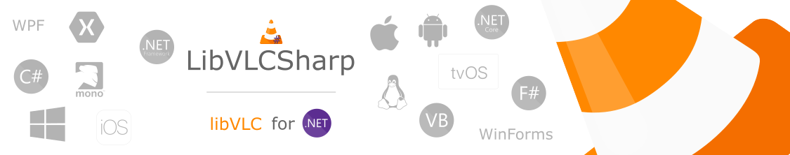

<h3 align="center">
    
</h3>

# LibVLCSharp

LibVLCSharp are .NET bindings for `libvlc`, the multimedia framework powering the VLC applications.

## Features

Check out [libvlc-nuget](https://github.com/mfkl/libvlc-nuget) to get a basic understanding of how `libvlc` works, what it can offer and how to install it with NuGet.

Some of the features include:

- Network browsing for distant filesystems (SMB, FTP, SFTP, NFS...).
- HDMI passthrough for Audio HD codecs, like E-AC3, TrueHD or DTS-HD.
- Stream to distant renderers, like Chromecast.
- 360 video and 3D audio playback with viewpoint change.
- Support for Ambisonics audio and more than 8 audio channels.
- Subtitles size modification live.
- Hardware decoding and display on all platforms.
- DVD playback and menu navigation.

## Status

Heavily inspired from [libvlcpp](https://code.videolan.org/videolan/libvlcpp/tree/master/vlcpp) and using parts from [Vlc.DotNet](https://github.com/ZeBobo5/Vlc.DotNet), LibVLCSharp is aimed at Xamarin platforms (iOS/Android first, Forms). 
[CppSharp](https://github.com/mono/CppSharp) was used at the beginning for bootstrapping.

Core public APIs are mostly done but still need a few things to be ironed out. Some tests need to be fixed and more need to be written. Integration with platforms is a work in progress.

#### Currently supported platforms (with working sample):
- Xamarin.Android
- Xamarin.iOS
- Xamarin.Forms
- Windows

#### Roadmap:
- macOS
- Linux (GTK)
- UWP
- Tizen
- Unity

All contributions are welcome.
