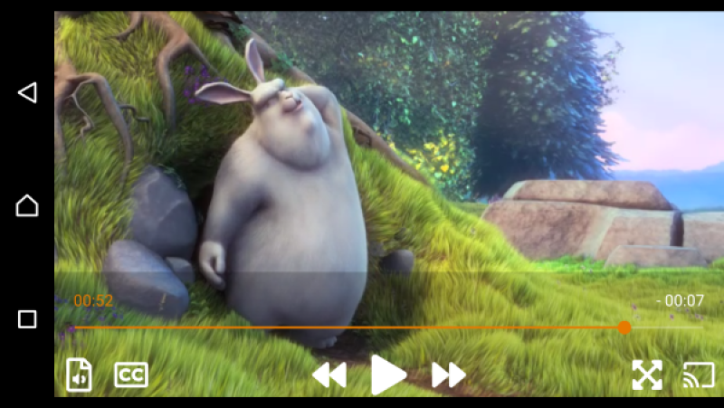

<h3 align="center">
    
</h3>

# LibVLCSharp

[](https://videolan.visualstudio.com/LibVLCSharp/_build/latest?definitionId=22&branchName=master)
[](https://gitter.im/libvlcsharp/Lobby)

LibVLCSharp is a cross-platform audio and video API for .NET platforms based on VideoLAN's LibVLC Library.
It provides a comprehensive multimedia API that can be used across mobile, server and desktop to render video and output audio as well as encode and stream.

_The official repository URL for this repo is https://code.videolan.org/videolan/LibVLCSharp._

- [LibVLCSharp](#LibVLCSharp)
  - [Features](#Features)
    - [MediaPlayerElement](#MediaPlayerElement)
  - [Supported platforms](#Supported-platforms)
  - [Installation](#Installation)
  - [Getting started](#Getting-started)
  - [Documentation](#Documentation)
  - [Samples](#Samples)
  - [Quick API overview](#Quick-API-overview)
  - [Roadmap](#Roadmap)
  - [Versioning](#Versioning)
  - [Release Notes](#Release-Notes)
  - [Contribute](#Contribute)
    - [Pull request](#Pull-request)
    - [Gitlab issues](#Gitlab-issues)
  - [Communication](#Communication)
    - [Forum](#Forum)
    - [Issues](#Issues)
    - [IRC](#IRC)
    - [StackOverflow](#StackOverflow)
  - [Code of Conduct](#Code-of-Conduct)
  - [License](#License)

## Features

Check out [libvlc-nuget](https://code.videolan.org/videolan/libvlc-nuget) to get a basic understanding of how `libvlc` works, what it can offer and how to install it with NuGet.

Some of the [features](https://www.videolan.org/vlc/features.html) include:

- Play every media file formats, every codec and every streaming protocols
- Run on every platform, from desktop (Windows, Linux, Mac) to mobile (Android, iOS) and TVs
- Hardware and efficient decoding on every platform, up to 8K
- Network browsing for distant filesystems (SMB, FTP, SFTP, NFS...) and servers (UPnP, DLNA)
- Playback of Audio CD, DVD and Bluray with menu navigation
- Support for HDR, including tonemapping for SDR streams
- Audio passthrough with SPDIF and HDMI, including for Audio HD codecs, like DD+, TrueHD or DTS-HD
- Support for video and audio filters
- Support for 360 video and 3D audio playback, including Ambisonics
- Able to cast and stream to distant renderers, like Chromecast and UPnP renderers.

Most things you can achieve with the regular VLC desktop app, you can also achieve using `libvlc`.

### MediaPlayerElement

Full featured video control for Xamarin.Forms available in LibVLCSharp.Forms (iOS/Android).

<h3 align="center">
  
</h3>

## Supported platforms

Mono, .NET Framework and .NET Core runtimes are supported.

- Xamarin.Android
- Xamarin.iOS
- Xamarin.tvOS
- Xamarin.Mac (Cocoa)
- Windows Classic (WPF, WinForms, GTK)
- Windows Universal (UWP for Desktop, mobile and Xbox)
- Linux including desktop, server and Raspberry Pi (GTK)
- Xamarin.Forms
- Uno Platform (UWP, Android, iOS)
- .NET Standard 1.1 and 2.0
- .NET Framework 4.0 and later
- .NET Core (including ASP.NET Core)
- [Unity3D](https://code.videolan.org/videolan/vlc-unity)
  - Windows Classic

## Installation

1. Install **LibVLC** in your platform specific project.

| Platform          | LibVLC Package                      | NuGet                                  | Minimum OS Version |
| ----------------- | ----------------------------------- | -------------------------------------- |--------------------|
| Windows           | VideoLAN.LibVLC.Windows             | [![LibVLCWindowsBadge]][LibVLCWindows] | Windows XP         |
| UWP               | VideoLAN.LibVLC.UWP                 | [![LibVLCWin10Badge]][LibVLCWin10]     | Windows 10         |
| Mac               | VideoLAN.LibVLC.Mac                 | [![LibVLCMacBadge]][LibVLCMac]         | macOS 10.7         |
| Android           | VideoLAN.LibVLC.Android             | [![LibVLCAndroidBadge]][LibVLCAndroid] | Android 2.3        |
| iOS               | VideoLAN.LibVLC.iOS                 | [![LibVLCiOSBadge]][LibVLCiOS]         | iOS 8.4            |
| tvOS              | VideoLAN.LibVLC.tvOS                | [![LibVLCtvOSBadge]][LibVLCtvOS]       | tvOS 10.2          |
| Linux             | [Linux guide](docs/linux-setup.md)  | N/A                                    | N/A                |

```cmd
dotnet add package VideoLAN.LibVLC.[Windows|UWP|Android|iOS|Mac|tvOS]
```

LibVLC is the actual VLC engine written mostly in C/C++ and compiled for your target platform. More information [here](https://code.videolan.org/videolan/libvlc-nuget).

2. Install **LibVLCSharp** _or_ **LibVLCSharp.Forms** (if you plan on using Xamarin.Forms)

| Platform          | LibVLCSharp Package                             | NuGet                                             |
| ----------------- | ----------------------------------------------- | ------------------------------------------------- |
| .NET Standard     | [LibVLCSharp](LibVLCSharp/README.md)            | [![LibVLCSharpBadge]][LibVLCSharp]                |
| Xamarin.Android   | [LibVLCSharp](LibVLCSharp/README.md)            | [![LibVLCSharpBadge]][LibVLCSharp]                |
| Xamarin.iOS       | [LibVLCSharp](LibVLCSharp/README.md)            | [![LibVLCSharpBadge]][LibVLCSharp]                |
| Xamarin.tvOS      | [LibVLCSharp](LibVLCSharp/README.md)            | [![LibVLCSharpBadge]][LibVLCSharp]                |
| Xamarin.Mac       | [LibVLCSharp](LibVLCSharp/README.md)            | [![LibVLCSharpBadge]][LibVLCSharp]                |
| UWP               | [LibVLCSharp](LibVLCSharp/README.md)            | [![LibVLCSharpBadge]][LibVLCSharp]                |
| Xamarin.Forms     | [LibVLCSharp.Forms](LibVLCSharp.Forms/README.md)| [![LibVLCSharpFormsBadge]][LibVLCSharpForms]      |
| WPF               | [LibVLCSharp.WPF](LibVLCSharp.WPF/README.md)    | [![LibVLCSharpWPFBadge]][LibVLCSharpWPF]          |
| Xamarin.Forms.WPF | [LibVLCSharp.Forms.WPF][RLibVLCSharpFormsWPF]   | [![LibVLCSharpFormsWPFBadge]][LibVLCSharpFormsWPF]|
| GTK               | [LibVLCSharp.GTK](LibVLCSharp.GTK/README.md)    | [![LibVLCSharpGTKBadge]][LibVLCSharpGTK]          |
| Xamarin.Forms.GTK | [LibVLCSharp.Forms.GTK][RLibVLCSharpFormsGTK]   | [![LibVLCSharpFormsGTKBadge]][LibVLCSharpFormsGTK]|
| Windows Forms     | [LibVLCSharp.WinForms][RLibVLCSharpWinForms]    | [![LibVLCSharpWinFormsBadge]][LibVLCSharpWinForms]|
| Uno Platform      | [LibVLCSharp.Uno][RLibVLCSharpUno]              | [![LibVLCSharpUnoBadge]][LibVLCSharpUno]          |
| Unity3D - Windows | [VLC for Unity (Windows)][RVLCUnityWindows]     | [![VLCUnityWindowsBadge]][VLCUnityWindows]        |

LibVLCSharp is the .NET wrapper that consumes `LibVLC` and allows you to interact with native code from C#/F#.

[RLibVLCSharpFormsWPF]: LibVLCSharp.Forms.Platforms.WPF/README.md
[RLibVLCSharpFormsGTK]: LibVLCSharp.Forms.Platforms.GTK/README.md
[RLibVLCSharpWinForms]: LibVLCSharp.WinForms/README.md
[RLibVLCSharpUno]: LibVLCSharp.Uno/README.md
[RVLCUnityWindows]: https://assetstore.unity.com/packages/tools/video/vlc-for-unity-windows-133979

[LibVLCWindowsBadge]: https://img.shields.io/nuget/v/VideoLAN.LibVLC.Windows.svg
[LibVLCWindows]: https://www.nuget.org/packages/VideoLAN.LibVLC.Windows/

[LibVLCWin10Badge]: https://img.shields.io/nuget/v/VideoLAN.LibVLC.UWP.svg
[LibVLCWin10]: https://www.nuget.org/packages/VideoLAN.LibVLC.UWP/

[LibVLCMac]: https://www.nuget.org/packages/VideoLAN.LibVLC.Mac/
[LibVLCMacBadge]: https://img.shields.io/nuget/v/VideoLAN.LibVLC.Mac.svg

[LibVLCAndroid]: https://www.nuget.org/packages/VideoLAN.LibVLC.Android/
[LibVLCAndroidBadge]: https://img.shields.io/nuget/v/VideoLAN.LibVLC.Android.svg

[LibVLCiOS]: https://www.nuget.org/packages/VideoLAN.LibVLC.iOS/
[LibVLCiOSBadge]: https://img.shields.io/nuget/v/VideoLAN.LibVLC.iOS.svg

[LibVLCtvOS]: https://www.nuget.org/packages/VideoLAN.LibVLC.tvOS/
[LibVLCtvOSBadge]: https://img.shields.io/nuget/v/VideoLAN.LibVLC.tvOS.svg

[LibVLCSharp]: https://www.nuget.org/packages/LibVLCSharp/
[LibVLCSharpBadge]: https://img.shields.io/nuget/v/LibVLCSharp.svg

[LibVLCSharpForms]: https://www.nuget.org/packages/LibVLCSharp.Forms/
[LibVLCSharpFormsBadge]: https://img.shields.io/nuget/v/LibVLCSharp.Forms.svg

[LibVLCSharpWPF]: https://www.nuget.org/packages/LibVLCSharp.WPF/
[LibVLCSharpWPFBadge]: https://img.shields.io/nuget/v/LibVLCSharp.WPF.svg

[LibVLCSharpFormsWPF]: https://www.nuget.org/packages/LibVLCSharp.Forms.WPF/
[LibVLCSharpFormsWPFBadge]: https://img.shields.io/nuget/v/LibVLCSharp.Forms.WPF.svg

[LibVLCSharpGTK]: https://www.nuget.org/packages/LibVLCSharp.GTK/
[LibVLCSharpGTKBadge]: https://img.shields.io/nuget/v/LibVLCSharp.GTK.svg

[LibVLCSharpFormsGTK]: https://www.nuget.org/packages/LibVLCSharp.Forms.GTK/
[LibVLCSharpFormsGTKBadge]: https://img.shields.io/nuget/v/LibVLCSharp.Forms.GTK.svg

[LibVLCSharpWinForms]: https://www.nuget.org/packages/LibVLCSharp.WinForms/
[LibVLCSharpWinFormsBadge]: https://img.shields.io/nuget/v/LibVLCSharp.WinForms.svg

[LibVLCSharpUno]: https://www.nuget.org/packages/LibVLCSharp.Uno/
[LibVLCSharpUnoBadge]: https://img.shields.io/nuget/v/LibVLCSharp.Uno.svg

[VLCUnityWindows]: https://assetstore.unity.com/packages/tools/video/vlc-for-unity-windows-133979
[VLCUnityWindowsBadge]: https://img.shields.io/badge/Made%20with-Unity-57b9d3.svg?style=flat&logo=unity

## Getting started

Follow the [Getting started guide](docs/getting_started.md). Make sure you read it since it contains platform-specific caveats

## Documentation

Our [Documentation](docs/home.md) includes [best practices](docs/best_practices.md), [Q&A guide](docs/how_do_I_do_X.md), [libvlc specific information](docs/libvlc_documentation.md) and [tutorials](docs/tutorials.md).

## Samples

For more advanced samples, have a look at [libvlcsharp-samples](https://code.videolan.org/mfkl/libvlcsharp-samples). It currently includes:

- [Chromecast sample](https://code.videolan.org/mfkl/libvlcsharp-samples/tree/master/Chromecast): Discover chromecasts on your local network and select one for playback in 100% shared code (Xamarin.Forms, iOS/Android).
- [Record HLS sample](https://code.videolan.org/mfkl/libvlcsharp-samples/tree/master/RecordHLS): Simple .NET Core CLI app which shows how to record an HLS stream to the filesystem.
- [RTSP Mosaic sample](https://code.videolan.org/mfkl/libvlcsharp-samples/tree/master/VideoMosaic): Cross-platform RTSP player sample with 4 views mosaic (Xamarin.Forms, iOS/Android).
- [PulseMusic UX sample](https://code.videolan.org/mfkl/libvlcsharp-samples/tree/master/PulseMusic): A stylish music player UX example using Skia on iOS and Android.
- [Gestures sample](https://code.videolan.org/mfkl/libvlcsharp-samples/tree/master/Gestures/Gestures): Cross-platform touch gestures and 360 videos on iOS and Android.
- [LocalNetwork sample](https://code.videolan.org/mfkl/libvlcsharp-samples/tree/master/LocalNetwork): Cross-platform local network browsing and playback with network shares (SMB, UPnP) on Android, iOS and WPF.
- [MediaPlayerElement sample](https://code.videolan.org/mfkl/libvlcsharp-samples/tree/master/MediaElement): Minimal iOS/Android sample showing how to get started with the crossplatform MediaPlayerElement control from LibVLCSharp.Forms.
- [SkiaSharp Preview Thumbnailer sample](https://code.videolan.org/mfkl/libvlcsharp-samples/tree/master/PreviewThumbnailExtractor.Skia): .NET Core sample app showing how to use LibVLC 3 video callbacks and encode the frame with SkiaSharp before saving it to disk.

Feel free to suggest and contribute new samples.

## Quick API overview

- [`LibVLC.cs`](https://github.com/videolan/libvlcsharp/blob/master/LibVLCSharp/Shared/LibVLC.cs): Main object pointing to a native `libvlc` instance in native code.
- [`MediaPlayer.cs`](https://github.com/videolan/libvlcsharp/blob/master/LibVLCSharp/Shared/MediaPlayer.cs): Manages playback, offers event listeners and more. Accessible from `VideoView` with data-binding support.
- [`Media.cs`](https://github.com/videolan/libvlcsharp/blob/master/LibVLCSharp/Shared/Media.cs): Class representing and providing information about a media such as a video or audio file or stream.
- `VideoView.cs`: Custom native view which holds a `MediaPlayer` object.
- [`MediaDiscoverer.cs`](https://github.com/videolan/libvlcsharp/blob/master/LibVLCSharp/Shared/MediaDiscoverer.cs): This object should be used to find media on NAS and any SMB/UPnP-enabled device on your local network.
- [`RendererDiscoverer.cs`](https://github.com/videolan/libvlcsharp/blob/master/LibVLCSharp/Shared/RendererDiscoverer.cs): Use this to find and use a Chromecast or other distant renderers.
- [`Dialog.cs`](https://github.com/videolan/libvlcsharp/blob/master/LibVLCSharp/Shared/Dialog.cs): Dialogs can be raised from the `libvlc` engine in some cases. Register callbacks with this object.

The [LibVLCSharp.Forms](LibVLCSharp.Forms/README.md) package features a `MediaPlayerElement` Xamarin.Forms control, similar to the ones provided by the .NET Framework on WPF and UWP. It currently supports iOS and Android.

## Roadmap

- Game engines (Unity, Unreal, Godot)

If you have a request or question regarding the roadmap, feel free to open an [issue](https://code.videolan.org/videolan/LibVLCSharp/issues) (using an issue template) or [PR](https://github.com/videolan/libvlcsharp/pulls).

## Versioning

As this is a libvlc binding, we try to follow the libvlc versioning scheme as much as possible. The versioning strategy is explained in the [VERSIONING](VERSIONING.md) document.

## Release Notes

Check out the [NEWS](NEWS) file for details about each release.

## Contribute

### Pull request

Pull requests are more than welcome! If you do submit one, please make sure to read the [contributing guidelines](CONTRIBUTING.md) first, and use our pull request template.

### Gitlab issues

You can look through issues we currently have on the [VideoLAN Gitlab](https://code.videolan.org/videolan/LibVLCSharp). Please pick one of our GitLab issue templates so we can assist you better.

## Communication

### Forum

If you have any question or if you're not sure it's actually an issue, please visit our [forum](https://forum.videolan.org/).

### Issues

You have encountered an issue and wish to report it to the VLC dev team?

You can create one on our [Gitlab](https://code.videolan.org/videolan/LibVLCSharp/issues) or on our [bug tracker](https://trac.videolan.org/vlc/).

Before creating an issue or ticket, please double check for duplicates!

### IRC

Want to quickly get in touch with us for a question, or even just to talk?

You will always find someone from the VLC team on IRC, __#videolan__ channel on the freenode network.

If you don't have an IRC client, you can always use the [freenode webchat](https://webchat.freenode.net/).

We are also on Gitter [](https://gitter.im/libvlcsharp/Lobby)

### StackOverflow

We regularly monitor the `libvlcsharp` tag on [](https://stackoverflow.com/questions/tagged/libvlcsharp)

## Code of Conduct

Please read and follow the [VideoLAN CoC](https://wiki.videolan.org/Code_of_Conduct/) license.

## License

LibVLCSharp is under the LGPLv2.1.

Note: the .NET4.0 LibVLCSharp build references a nuget package that may indicate its license as the .NET Library license but it's actually [opensource](https://github.com/Microsoft/referencesource/commit/6952d2c3923d30a4d88bf57120688b9532bbe1d8) under MIT.

<br/>
<h3 align="center">
    <a href="https://code.videolan.org/videolan/LibVLCSharp"></a>
</h3>
