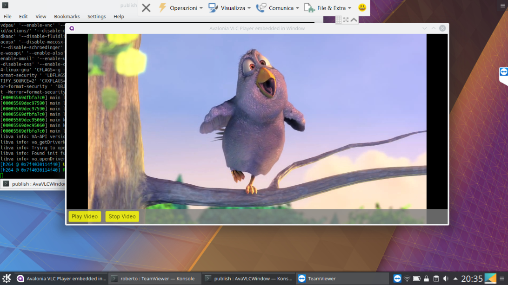
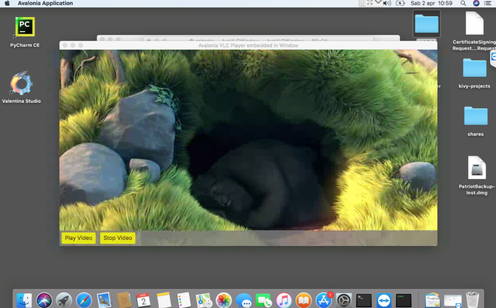

# LibVLCSharp.Avalonia.Unofficial.Samples

The samples show how to use the **LibVLCSharp.Avalonia.Unofficial** project and specifically: 

- **How to embed LibVLCSharp Avalonia VLC VideoView in Avalonia Window** (*AvaVLCWindow*)
- **How to embed LibVLCSharp Avalonia VLC VideoView in Avalonia UserControl** (*AvaVLCControl*)
- **How to put and use an Avalonia UserControl on top of VideoView (VLC MediaPlayer)**, for example, a set of buttons/controls to control the VLC MediaPlayer (*in both samples*).

Each sample is a full solution buildable in Visual Studio 2019.

Successfully tested on Windows 10, Kubuntu 18.04, MacOS 10.13 and Raspberry pi3-modB DietPi

### Some images from tests

**Kubuntu 18.04**

**MacOS 10.13 (High Sierra)**

**Raspberry DietPi(META)**
.png)

### References:

- https://stackoverflow.com/a/71696308/4973374
- https://github.com/AvaloniaUI/Avalonia/issues/6237#issuecomment-1084914382
- https://github.com/AvaloniaUI/Avalonia/issues/2571#issuecomment-1084671987